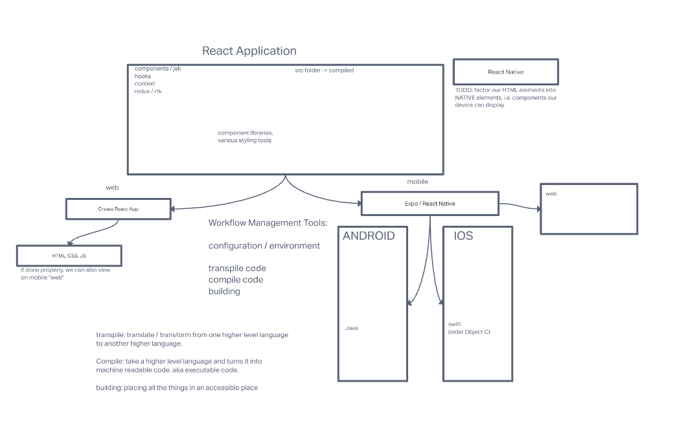

# LAB - react native 

## Project: Food-blog

### Author: hunter fehr

### Problem Domain  

desiging a aplication that allows you to take a photo and put it into a section where you can add text and description as a user

### Links and Resources

- [GitHub Actions](https://github.com/hmfehr/food-blog)
- run npm start and take scan qr code
-trace dugar
-matt miguel
-chatgpt

#### Features / Routes

- Feature One: allows user to allow access to front and back of their device
- Feature Two: create button to beable to take a photo and look at examples of being to view and add a description to the photo.

#### UML

